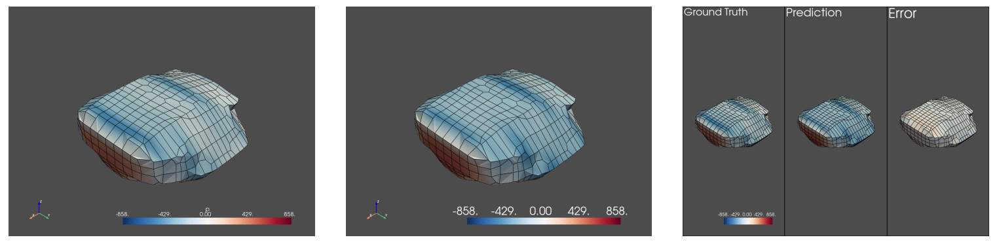

# Meshnets project

While virtual wind tunnels are a much cheaper and flexible option than
using a real physical wind tunnel for initial design iterations,
realistic and high-fidelity simulations still require massive amounts
of computation. Typical computational fluid dynamic (CFD) simulations,
like the ones shown above, may take many hours to run, even on
large-scale computational infrastructures. This hinders the ability of
engineers to explore more variations of the design and slows down the
speed of project development. This is where Machine Learning
techniques can help the world of simulation and engineering.

In this repository you will find the necessary code to train the
models on data obtained from virtual wind tunnels.

# Running the code

This section will go over the necessary steps to train your own
models.

## Data

The first thing that is required to train neural networks is obviously
data. If you have your own dataset, great!! You only need to make sure
that it obeys the following structure:

```
.
└── data_set/
    ├── sim_1/
    │   └── sim.vtk
    └── sim_2/
        └── sim.vtk
```

The folder and file names can change.

If you do not have your own data you can download one of our datasets
[here](https://drive.google.com/u/0/uc?id=1T5wXz-igXjrztLt6xgb4CZx4tGwXK8DX&export=download). This
particular dataset has 1000 examples of objects:



Actually, in the image, we can see an example of an object and the
predictions of one of our models.


The next step is to pre-process the dataset. To do this just run the
script:

```bash
python process --data_dir=<Path to your dataset>
```

You will see `.pt` objects appearing next to the `.vtk` objects. These
are the torch graphs already constructed.

## Mlflow

We are using
[mlflow](https://mlflow.org/docs/latest/python_api/mlflow.html) to
keep track of our experiments. We have our own remote server to which
we can log everything from any computer which was created following
the instructions in [this
tutorial](https://towardsdatascience.com/managing-your-machine-learning-experiments-with-mlflow-1cd6ee21996e).

This is a nice feature to have but it is not required in any way to
run our code. Everything will be logged locally by default. That is,
all experiments will be logged to the folder `mlruns` created in the
directory from which the script is launched. To then look at the
experiments in the browser we just need to run the command `mlflow
ui`.

## Installing everything

The next step is to actually clone the repository using:

```bash
git clone https://github.com/inductiva/meshnets.git
```

The very next step is to create a virtual environment. This will solve
any clashes with the library versions used here and anything else that
might be installed in your own system:

```bash
python3 -m venv .env
source .env/bin/activate
```

After creating and activating the virtual environment we can install
all the requirements of the project using:

```bash
pip install --upgrade pip
pip install -r requirements.txt
```

Next, because `meshnets` is actually packaged we can install it using:

```bash
pip install -e .
```

## Training the models

Now to the fun part. Training a model is simply a matter of running
the script `train.py`:

```python
python train.py --data_dir=<Path to your dataset>
--val_data_dirs=<Path(s) to validation datasets> --other_flags
```

all other flags, their description and default values can be inspected
by running:

```python
python train.py --help
```

**Note**: Depending on your machine you may need to set the `num_cpus_per_worker` to an appropriate number of CPUs. A number higher than your machine/cluster has and it will block training from being launched.


